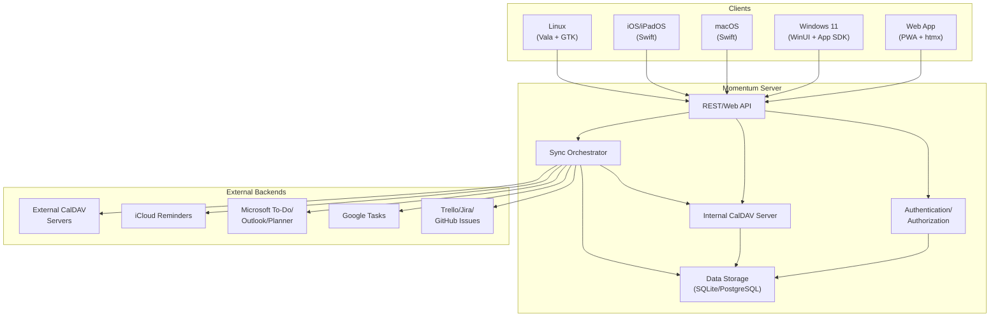

# Design Overview

This document outlines the design and architecture of Momentum.

## Overview

Momentum brings your to-dos, reminders, and CalDAV tasks into one flow — visible as lists or boards. Designed for people who want to see their life in motion.

## Architecture

Momentum follows a **client-server architecture** with shared core logic to minimize code duplication across platform-native clients.

### Deployment Models

- **SaaS**: Hosted Momentum server with managed infrastructure, authentication, and updates
- **Self-hosted**: Single-executable server running as:
  - Linux: systemd service
  - Windows: Windows service
  - Default DB: SQLite (single-file); optional PostgreSQL for multi-user scenarios

### Communication

- **HTTPS/TLS 1.3+ only**: All network traffic is encrypted; plaintext HTTP is rejected
- **REST/Web API**: Client-server communication via standard HTTP methods
- **CalDAV protocol**: Standard RFC 4791 for task (VTODO) operations

## Key Components

### 1. Server Components

#### Authentication & Authorization
- User account management with Argon2id password hashing
- OAuth/OIDC support for external service integrations
- Client certificate validation for CalDAV servers
- Per-user backend access control
- Encrypted credential storage at rest

#### Internal CalDAV Server
- RFC 4791 compliant CalDAV implementation
- Manages VTODO entities as canonical task format
- Local operation (no OS firewall prompts)
- Default backend for new users
- Supports full VTODO lifecycle: create, read, update, delete

#### Sync Orchestrator
- Idempotent sync operations for reliability
- Per-backend sync state tracking with checkpoints
- Conflict detection and resolution
- Rate limiting and error handling
- Incremental sync to minimize data transfer
- Handles schema differences across backends

#### Data Storage (RDBMS)
- **SQLite**: Default for single-user/self-hosted installations
- **PostgreSQL**: Optional for larger deployments
- Stores:
  - User accounts and authentication data
  - Backend configurations and credentials (encrypted)
  - Sync state and checkpoints
  - Task metadata and mappings
- Migrations managed via Liquibase for cross-DB compatibility

### 2. Client Components

#### Web Application
- Progressive Web App (PWA) with offline capabilities
- Installable on desktop and mobile browsers
- Uses htmx for progressive enhancement where feasible
- Responsive design for desktop and mobile viewports
- Shared UI patterns across all clients

#### Native Desktop Clients
- **Windows 11**: WinUI 3 + Windows App SDK
- **macOS**: Swift with AppKit
- **Linux**: Vala + GTK 4 (.deb/.rpm/Arch packages)

#### Native Mobile Clients
- **iOS/iPadOS**: Swift with UIKit/SwiftUI
- Shared Swift code between macOS and iOS where practical

#### Shared Core Logic
- Task model and VTODO mapping
- Validation and business rules
- Sync coordination logic
- Backend abstraction layer
- Shared across all clients to ensure consistency

### 3. External Integrations

#### CalDAV Servers
- Connect via URL, username/password, or client certificates
- Full VTODO synchronization
- Label/tag mapping to CATEGORIES

#### Future Backend Integrations
- iCloud Reminders (CloudKit API)
- Microsoft To-Do, Outlook Tasks, Planner (Microsoft Graph API)
- Google Tasks (Google Tasks API)
- Trello (Trello API)
- Jira (Jira REST API)
- GitHub Issues and Projects (GitHub GraphQL API)

### 4. Task Model

#### Canonical VTODO Fields
- **UID**: Unique identifier
- **SUMMARY**: Task title
- **DESCRIPTION**: Detailed task description
- **STATUS**: Task status (e.g., NEEDS-ACTION, IN-PROCESS, COMPLETED, CANCELLED)
- **DTSTART**: Start date/time
- **DUE**: Due date/time
- **PRIORITY**: Task priority (1-9)
- **CATEGORIES**: Labels/tags
- **RELATED-TO**: Subtask relationships
- **ATTACH**: Attachments (backend-dependent)

#### Backend Mapping
- Internal mapping layer translates between VTODO and backend-specific formats
- Preserves metadata during transfers between backends
- Handles schema differences and limitations

## Design Principles

### 1. Standards-First
- **CalDAV VTODO as canonical format**: Ensures data portability and vendor neutrality
- **RFC compliance**: Follow established protocols and standards
- **Open formats**: Avoid proprietary lock-in

### 2. Security by Default
- **TLS-only communication**: HTTPS/TLS 1.3+ with strong cipher suites exclusively
- **Encrypted credentials**: OS keychain integration on clients; encrypted at rest on server
- **Least privilege**: Minimal permission scopes; per-user backend access
- **Regular security updates**: Dependency audits and vulnerability scanning in CI

### 3. Separation of Concerns
- **Shared core logic**: Business rules and models shared across platforms
- **Platform-native UIs**: Leverage native UI frameworks for best user experience
- **Backend abstraction**: Generic task interface with backend-specific adapters

### 4. Simplicity
- **Single-executable server**: No complex installation or dependencies
- **Minimal configuration**: Environment variables and simple config files
- **SQLite by default**: Zero-configuration database for self-hosting
- **Progressive enhancement**: Web app works without JavaScript, enhanced with it

### 5. Reliability
- **Idempotent operations**: Sync operations can be safely retried
- **Conflict detection**: Detect and resolve conflicts during synchronization
- **Incremental sync**: Only transfer changed data
- **Graceful degradation**: Handle backend failures without data loss

### 6. Performance
- **Responsive UI**: Board interactions remain smooth with 1,000+ tasks
- **Efficient sync**: Minimize network traffic and database operations
- **Lazy loading**: Load data on demand where appropriate
- **Optimistic UI updates**: Update UI immediately, sync in background

### 7. Portability
- **Cross-platform**: Native clients for Windows, macOS, Linux, iOS, iPadOS, and web
- **Data export**: Users can export tasks to standard formats
- **Backend transfers**: Move tasks between services without data loss
- **Self-contained**: Self-hosted server runs anywhere with minimal dependencies

### 8. Extensibility
- **Plugin architecture**: Future support for custom integrations
- **API-first design**: Well-defined REST API for third-party tools
- **Modular backends**: Easy to add new task source integrations
- **Configurable workflows**: Users can customize status columns and transitions